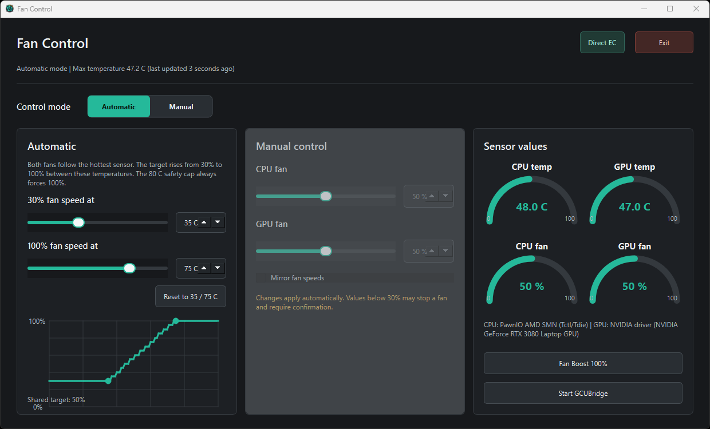

# Stellaris 15 Gen3 Fan Control

An experimental fan-control application for my Stellaris 15 Gen3 laptop, designed to work around an unreliable OEM CPU-temperature path.

> [!CAUTION]
> I built this project for my own Stellaris 15 Gen3, and it remains experimental. It replaces fan curves through either the installed OEM Control Center service or the validated OEM EC driver interface. A software defect, invalid sensor value, or incompatible laptop can cause overheating, instability, hardware damage, or data loss. Use it at your own risk, keep an independent temperature monitor visible, and be ready to enable Fan Boost or shut down the laptop.

> [!WARNING]
> This project can interfere with the installed OEM fan-control application or its configuration. After custom curves are written, the Control Center GUI may display unusual curves, incorrect-looking values, broken layouts, or other unexpected behavior. Recovery may require restoring a backup, resetting Control Center, or reinstalling it. This project does not intentionally modify OEM program files, but it does change the fan data consumed by that software.



## Why I Built This

The embedded-controller path on my laptop stopped providing a reliable CPU temperature. As a result, the original fan curve could leave the system undercooled while the CPU temperature increased.

This application works around that failure. It supports separate manual CPU and GPU fan settings, or automatic control driven by independent CPU and GPU temperature sources.

I built and tested it for one Stellaris 15 Gen3 / XMG-Uniwill-style laptop running OEM Control Center 3.9.42.1. MQTT messages, table names, curve formats, authentication, and embedded-controller behavior may differ on other laptops or Control Center versions. Similar hardware is not proof of compatibility.

## How It Works

- While the OEM `GCUBridge` broker is running, fan commands use the existing Control Center MQTT method.
- When that broker is stopped or unavailable, the backend switches to direct EC fan-table access through the installed, hash-validated Uniwill ACPI driver library. It switches back to OEM MQTT when the broker returns.
- CPU temperature comes directly from the Ryzen `Tctl/Tdie` SMN register through the signed [PawnIO](https://github.com/namazso/PawnIO) driver and a restricted AMD module.
- The broken Control Center CPU-temperature value is never used in Automatic mode.
- GPU temperature comes from the NVIDIA driver through `nvidia-smi`.
- Manual mode applies slider and spin-box changes automatically in 5% steps. CPU and GPU targets can remain independent or be linked with **Mirror fan speeds**. Any value below 30% requires explicit confirmation.
- Automatic mode checks temperatures every 15 seconds, uses `max(CPU, GPU)`, and sends one shared target to both fans.
- The sensor panel displays CPU and GPU temperature gauges plus reported CPU and GPU fan-duty gauges.
- The sensor panel can start or stop `GCUBridge` after an explicit confirmation, switching between OEM MQTT and direct EC control.
- The elevated backend is the only process allowed to read hardware sensors, communicate with Control Center, or access the direct EC fan interface.
- The normal-user frontend displays state and sends authenticated requests to the backend.
- Only one frontend, one backend, and one Control Center client may run at a time.

If either temperature is missing, zero, malformed, or implausible, Automatic mode fails closed and does not write a new fan target during that cycle.

Direct control is deliberately restricted to the EC project ID and OEM ACPI library hash validated on this laptop. While OEM MQTT is available, the backend caches the last complete OEM curve. If the OEM service later clears its EC tables while stopping, direct mode restores that cached curve, activates the traced OEM application/fan-subsystem state, and applies the new duties. It refuses a write if the OEM broker reappears before the operation, verifies all six 16-byte curve blocks and the control state, and attempts to restore every previous byte if verification fails. The same temperature sources and Automatic curve rules apply to both control methods.

The direct fan tables are addressed as volatile EC RAM, not through an EEPROM, CMOS, or firmware-flashing API. Matching Uniwill driver source uses the same locations as routinely rewritten EC fan-table RAM, and this application calls only the OEM DLL's `ReadEC`/`WriteEC` exports. Low-level EC access is still hardware-sensitive: writing an incorrect address or using this on incompatible firmware can cause malfunction even without flash wear.

## Automatic Curve

The two configurable temperature points accept values from 0 to 100 C:

| Default temperature | Fan duty |
| ---: | ---: |
| 35 C or below | 30% |
| 75 C or above | 100% |

The application interpolates linearly between the two points and rounds the result to the nearest 5%. Automatic mode never requests less than 30%. The fixed 80 C safety cap always forces 100%, even when the maximum-temperature slider is configured above 80 C.

Automatic is the startup mode. It starts an immediate validated cycle followed by non-overlapping 15-second cycles. Selecting **Manual** stops future automatic cycles.

The selected Automatic endpoints, Manual CPU/GPU targets, and mirror setting are stored beside the packaged executable in `StellarisFanControl.json`. A missing or malformed file safely falls back to the 35/75 defaults, 50% Manual targets, and mirroring disabled. The application always starts in Automatic mode; Manual values are remembered for the next time Manual is selected.

The inactive control section is disabled and visually dimmed. A badge beside **Exit** reports **OEM MQTT** or **Direct EC**. Sensor gauges, the confirmed **Start/Stop GCUBridge** control, and the OEM **Fan Boost 100%** fallback remain available in both modes.

## Application Process

The packaged application runs as one elevated process:

- Windows requests UAC approval as soon as `StellarisFanControl.exe` starts.
- The PySide6 interface, automatic scheduler, sensor access, and fan-control services share that process. Internal requests still pass through the same serialized controller boundary.

Closing the window hides it in the system tray, so Automatic mode and fan control continue. Clicking or double-clicking the tray icon restores the window. Source-mode frontend and backend entry points retain authenticated loopback IPC for development, but the packaged application dispatches UI requests directly inside the process and does not launch a companion executable.

The dedicated top-right **Exit** button and tray-menu **Exit** action require confirmation. After confirmation, the controller stops Automatic scheduling, disables Fan Boost, writes 80% to both fans, and exits only if that write succeeds.

## Requirements

- Windows 11
- Compatible OEM Control Center 3.9.42.1 installed; its service may be running or stopped
- Python 3.11 or newer when running from source
- Signed PawnIO driver
- Administrator access for the application
- NVIDIA GPU with a working `nvidia-smi.exe`

## Run from Source

```powershell
py -3 -m venv .venv
.\.venv\Scripts\python.exe -m pip install -r requirements.txt
.\scripts\run_fan_control_gui.cmd
```

The launcher runs `scripts\setup_pawnio.ps1`, installs PawnIO when necessary, downloads the pinned and SHA-256-verified AMD sensor module, and starts the GUI as a normal user. The PawnIO installer may display a separate one-time setup prompt. During normal use, Windows requests administrator access only for the hardware backend. Core Temp is not required.

## Low-Level CLI

Write commands are dry runs unless `--apply` is supplied:

```powershell
.\.venv\Scripts\python.exe .\backend\fan_control.py status
.\.venv\Scripts\python.exe .\backend\fan_control.py rpm
.\.venv\Scripts\python.exe .\backend\fan_control.py fixed 65 --gpu-duty 75
```

Inspect the preview before adding `--apply`. Manual writes create a backup of the active curve first. Source backups are stored in `fan-backups`; packaged builds use `%LOCALAPPDATA%\StellarisFanControl\fan-backups`.

## Build the Applications

```powershell
powershell.exe -ExecutionPolicy Bypass -File .\scripts\build_exe.ps1
```

The script creates the virtual environment when necessary, prepares PawnIO, installs the build requirements, and writes:

- `dist\StellarisFanControl.exe`, containing the interface, controller, stylesheet, and AMD sensor module.

Start the executable normally and accept its UAC prompt. Generated executables, PyInstaller files, downloaded modules, virtual environments, caches, and fan backups are excluded from Git.

## Recovery

Backups can be previewed and restored with:

```powershell
.\.venv\Scripts\python.exe .\backend\fan_control.py restore .\fan-backups\M2T1-TIMESTAMP.json
.\.venv\Scripts\python.exe .\backend\fan_control.py restore .\fan-backups\M2T1-TIMESTAMP.json --apply
```

The first command only displays the proposed restoration. The second command writes it.

A backup named `DIRECT_EC-*.json` must use the direct restore path while the OEM broker is stopped:

```powershell
.\.venv\Scripts\python.exe .\backend\fan_control.py restore .\fan-backups\DIRECT_EC-TIMESTAMP.json --direct
.\.venv\Scripts\python.exe .\backend\fan_control.py restore .\fan-backups\DIRECT_EC-TIMESTAMP.json --direct --apply
```

If temperatures rise unexpectedly, do not wait for this application to recover. Enable OEM Fan Boost immediately or shut down the laptop.

## Project Documentation

- [Design decisions and ideas](DESIGN.md)
- [File, folder, runtime, and dependency structure](STRUCTURE.md)
- [Important accident records](ACCIDENTS.md)
- [Prioritized technical debt, problems, and planned work](TODO.md)
