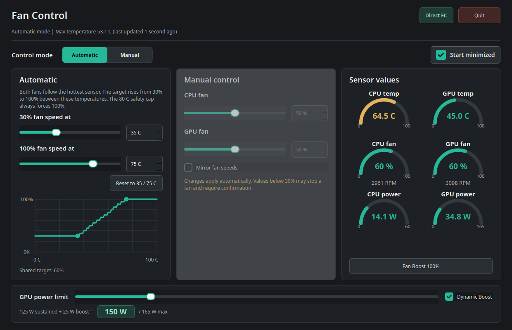

# Stellaris 15 Gen3 Fan Control

An experimental fan-control application for my Stellaris 15 Gen3 laptop on Windows 11 and Ubuntu 24.04, designed to work around an unreliable OEM CPU-temperature path.

> [!CAUTION]
> I built this project for my own Stellaris 15 Gen3, and it remains experimental. It replaces fan curves through the installed OEM Control Center service or the validated OEM EC driver interface on Windows, and through the firmware's EC memory window on Ubuntu. A software defect, invalid sensor value, or incompatible laptop can cause overheating, instability, hardware damage, or data loss. Use it at your own risk, keep an independent temperature monitor visible, and be ready to enable Fan Boost or shut down the laptop.

> [!WARNING]
> This project can interfere with the installed OEM fan-control application or its configuration. After custom curves are written, the Control Center GUI may display unusual curves, incorrect-looking values, broken layouts, or other unexpected behavior. Recovery may require restoring a backup, resetting Control Center, or reinstalling it. This project does not intentionally modify OEM program files, but it does change the fan data consumed by that software.



## Why I Built This

The embedded-controller path on my laptop stopped providing a reliable CPU temperature. As a result, the original fan curve could leave the system undercooled while the CPU temperature increased.

This application works around that failure. It supports separate manual CPU and GPU fan settings, or automatic control driven by independent CPU and GPU temperature sources.

I built and tested it for one Stellaris 15 Gen3 / XMG-Uniwill-style laptop running OEM Control Center 3.9.42.1. MQTT messages, table names, curve formats, authentication, and embedded-controller behavior may differ on other laptops or Control Center versions. Similar hardware is not proof of compatibility.

## How It Works

- While the OEM `GCUBridge` broker is running, fan commands use the existing Control Center MQTT method.
- When that broker is stopped or unavailable, the backend switches to direct EC fan-table access through the installed, hash-validated Uniwill ACPI driver library. It switches back to OEM MQTT when the broker returns.
- CPU temperature comes directly from the Ryzen `Tctl/Tdie` SMN register through the signed [PawnIO](https://github.com/namazso/PawnIO) driver and a restricted AMD module.
- The broken Control Center CPU-temperature value is never used in Automatic mode.
- GPU temperature comes from the NVIDIA driver through `nvidia-smi`.
- Manual mode applies slider and spin-box changes automatically in 5% steps. CPU and GPU targets can remain independent or be linked with **Mirror fan speeds**. Any value below 30% requires explicit confirmation.
- Automatic mode checks temperatures every 15 seconds, uses `max(CPU, GPU)`, and sends one shared target to both fans.
- The sensor panel displays CPU and GPU temperature gauges plus reported CPU and GPU fan-duty gauges.
- The sensor panel can start or stop `GCUBridge` after an explicit confirmation, switching between OEM MQTT and direct EC control.
- The elevated backend is the only process allowed to read hardware sensors, communicate with Control Center, or access the direct EC fan interface.
- The normal-user frontend displays state and sends authenticated requests to the backend.
- Only one frontend, one backend, and one Control Center client may run at a time.

If either temperature is missing, zero, malformed, or implausible, Automatic mode fails closed and does not write a new fan target during that cycle. If no valid CPU or GPU reading succeeds for 30 seconds, in any mode, the backend enables EC Fan Boost (100% on both fans) and holds it until the sensors recover. Manual changes and turning Boost off are refused meanwhile. Afterwards Automatic mode resumes, or the last Manual duties are restored.

Direct control is deliberately restricted to the EC project ID and OEM ACPI library hash validated on this laptop. While OEM MQTT is available, the backend caches the last complete OEM curve. If the OEM service later clears its EC tables while stopping, direct mode restores that cached curve, activates the traced OEM application/fan-subsystem state, and applies the new duties. It refuses a write if the OEM broker reappears before the operation, verifies all six 16-byte curve blocks and the control state, and attempts to restore every previous byte if verification fails. The same temperature sources and Automatic curve rules apply to both control methods.

The direct fan tables are addressed as volatile EC RAM, not through an EEPROM, CMOS, or firmware-flashing API. Matching Uniwill driver source uses the same locations as routinely rewritten EC fan-table RAM, and this application calls only the OEM DLL's `ReadEC`/`WriteEC` exports. Low-level EC access is still hardware-sensitive: writing an incorrect address or using this on incompatible firmware can cause malfunction even without flash wear.

## Automatic Curve

The two configurable temperature points accept values from 0 to 100 C:

| Default temperature | Fan duty |
| ---: | ---: |
| 35 C or below | 30% |
| 75 C or above | 100% |

The application interpolates linearly between the two points and rounds the result to the nearest 5%. Automatic mode never requests less than 30%. The fixed 80 C safety cap always forces 100%, even when the maximum-temperature slider is configured above 80 C.

Automatic is the startup mode. It starts an immediate validated cycle followed by non-overlapping 15-second cycles. Switching between **Automatic** and **Manual** requires confirmation; canceling keeps the current mode. Selecting **Manual** stops future automatic cycles.

The selected Automatic endpoints, Manual CPU/GPU targets, and mirror setting are stored beside the packaged executable in `StellarisFanControl.json`. A missing or malformed file safely falls back to the 35/75 defaults, 50% Manual targets, and mirroring disabled. The application always starts in Automatic mode; Manual values are remembered for the next time Manual is selected.

The inactive control section is disabled and visually dimmed. A badge beside **Exit** reports **OEM MQTT** or **Direct EC**. Sensor gauges, the confirmed **Start/Stop GCUBridge** control, and the OEM **Fan Boost 100%** fallback remain available in both modes.

## Application Process

The packaged application runs as one elevated process:

- Windows requests UAC approval as soon as `StellarisFanControl.exe` starts.
- The PySide6 interface, automatic scheduler, sensor access, and fan-control services share that process. Internal requests still pass through the same serialized controller boundary.

Closing the window hides it in the system tray, so Automatic mode and fan control continue. Clicking or double-clicking the tray icon restores the window. Source-mode frontend and backend entry points retain authenticated loopback IPC for development, but the packaged application dispatches UI requests directly inside the process and does not launch a companion executable.

Enable **Start minimized** beside the control-mode selector to start in the system tray on subsequent launches, including sign-in startup. This preference is saved in `StellarisFanControl.json` and defaults to on. Changing it does not hide the current window or change fan control. If no system tray is available, the window starts minimized on the taskbar. The tray's **Show Fan Control** action or launching the app again restores the window. The tray's **About** action opens this project's GitHub page.

The dedicated top-right **Exit** button and tray-menu **Exit** action require confirmation. After confirmation, the controller stops Automatic scheduling, disables Fan Boost, writes 100% to both fans, and exits only if that write succeeds.

Windows shutdown, restart, and sign-out also request 100% on both fans before acknowledging session shutdown, without an extra Exit confirmation. The request runs behind any active frontend operation; Automatic scheduling stops after a successful write. A failed or timed-out request asks Windows to cancel shutdown. If another application cancels shutdown after our write succeeds, Fan Control still exits with both targets at 100%. Forced termination, power loss, or Windows ending the process before the operation completes cannot be guaranteed.

## Requirements (Windows)

- Windows 11
- Compatible OEM Control Center 3.9.42.1 installed; its service may be running or stopped
- Python 3.11 or newer when running from source
- Signed PawnIO driver
- Administrator access for the application
- NVIDIA GPU with a working `nvidia-smi.exe`

## Install from a GitHub Release (Windows, No Python Required)

1. Open [Releases](https://github.com/salihmarangoz/stellaris_15_gen3_fanspeed_override/releases/latest) and download `StellarisFanControl-windows-x64.zip` and its `.sha256` file from the same release. These assets appear after the first release workflow succeeds; the GitHub-generated source archives do not contain the executable.
2. Optionally compare `Get-FileHash .\StellarisFanControl-windows-x64.zip -Algorithm SHA256` with the downloaded checksum, then extract the entire ZIP to a folder.
3. Open PowerShell in the extracted folder and run:

   ```powershell
   powershell.exe -NoProfile -ExecutionPolicy Bypass -File .\scripts\install.ps1
   ```

Approve the administrator prompt using your own Windows administrator account. The script installs or updates PawnIO when needed (an Internet connection and Windows Package Manager are required for that step), verifies the pinned AMD module, copies the application into `%ProgramFiles%\StellarisFanControl`, and registers the **Stellaris Fan Control** startup task. The compatible OEM Control Center and NVIDIA driver must already be installed.

The task starts with highest privileges whenever you sign in, including after reboot. It uses your interactive sign-in rather than pre-login system boot so the window and tray icon are accessible. Installation does not launch the application. Launch `%ProgramFiles%\StellarisFanControl\StellarisFanControl.exe` yourself or sign out and back in when ready; every launch starts Automatic mode and can write fan targets. Closing the window keeps it running in the tray.

To update, exit the running application using its confirmed **Exit** action, then repeat the installer from the new release. The installer preserves `StellarisFanControl.json` and replaces the existing startup task. The extracted download or source folder can subsequently move without breaking startup.

To disable automatic startup, disable **Stellaris Fan Control** in Task Scheduler. To enable it again, enable that task or rerun the installer. Release builds are not code-signed; Windows may show an unknown-publisher warning.

## Run from Source on Windows (Alternative)

```powershell
py -3 -m venv .venv
.\.venv\Scripts\python.exe -m pip install -r requirements.txt
.\scripts\run_fan_control_gui.cmd
```

The launcher runs `scripts\setup_pawnio.ps1`, installs PawnIO when necessary, downloads the pinned and SHA-256-verified AMD sensor module, and starts the GUI as a normal user. The PawnIO installer may display a separate one-time setup prompt. During normal use, Windows requests administrator access only for the hardware backend. Core Temp is not required.

## Low-Level CLI

Write commands are dry runs unless `--apply` is supplied:

```powershell
.\.venv\Scripts\python.exe .\backend\fan_control.py status
.\.venv\Scripts\python.exe .\backend\fan_control.py rpm
.\.venv\Scripts\python.exe .\backend\fan_control.py fixed 65 --gpu-duty 75
```

Inspect the preview before adding `--apply`. Manual writes create a backup of the active curve first. Source backups are stored in `fan-backups`; packaged builds use `%LOCALAPPDATA%\StellarisFanControl\fan-backups`.

## Build the Applications

```powershell
powershell.exe -ExecutionPolicy Bypass -File .\scripts\build_exe.ps1
```

The script creates the virtual environment when necessary, prepares PawnIO, installs the build requirements, and writes:

- `dist\StellarisFanControl.exe`, containing the interface, controller, stylesheet, and AMD sensor module.

Start the executable normally and accept its UAC prompt. Generated executables, PyInstaller files, downloaded modules, virtual environments, caches, and fan backups are excluded from Git.

For packaging on a machine without the target hardware, use `scripts\build_exe.ps1 -SkipDriverInstall`. This skips only driver installation; the pinned AMD module is still downloaded and hash-verified. It does not make the application usable without PawnIO on the target laptop.

## Install the Packaged Application

After building, run:

```powershell
powershell.exe -ExecutionPolicy Bypass -File .\scripts\install.ps1
```

Approve the administrator prompt. The installer creates `%ProgramFiles%\StellarisFanControl`, copies `StellarisFanControl.exe` into it, and registers a per-user Task Scheduler entry named `Stellaris Fan Control`. The task starts the application with highest privileges when the installing user next signs in. A sign-in trigger is used instead of a system-boot trigger because the application requires the user's interactive desktop for its window and tray icon.

Installation does not launch the application immediately. This avoids starting Automatic mode, and therefore avoids a live fan write, as a side effect of installing it.

## Publish a Release

The **Release** workflow builds on Windows x64 with Python 3.14, runs compilation and mocked/offscreen tests without accessing hardware, and packages the executable, installer, PawnIO setup script, pinned module, README, and third-party notices into a ZIP with a SHA-256 checksum. A second job runs the same tests on Ubuntu 24.04 and packages the Linux source release `StellarisFanControl-linux.tar.gz` with its checksum. CI does not install PawnIO, touch the EC, or launch the application. Tagged releases publish both archives.

After committing and pushing the desired code and workflow, push a version tag, for example:

```powershell
git tag v1.0.0
git push origin v1.0.0
```

A successful tag build publishes a GitHub Release with the ZIP and checksum. Use a new tag for each release; existing releases are not overwritten. The workflow's manual **Run workflow** option on a branch builds downloadable Actions artifacts without publishing a release. Running it on a `v*` tag also publishes, so use an unreleased tag. Building locally uses the same scripts:

```powershell
powershell.exe -ExecutionPolicy Bypass -File .\scripts\build_exe.ps1
powershell.exe -ExecutionPolicy Bypass -File .\scripts\package_release.ps1
```

The archive is `dist\StellarisFanControl-windows-x64.zip`. Automated checks do not replace hardware validation on the supported laptop.

## Recovery

Backups can be previewed and restored with:

```powershell
.\.venv\Scripts\python.exe .\backend\fan_control.py restore .\fan-backups\M2T1-TIMESTAMP.json
.\.venv\Scripts\python.exe .\backend\fan_control.py restore .\fan-backups\M2T1-TIMESTAMP.json --apply
```

The first command only displays the proposed restoration. The second command writes it.

A backup named `DIRECT_EC-*.json` must use the direct restore path while the OEM broker is stopped:

```powershell
.\.venv\Scripts\python.exe .\backend\fan_control.py restore .\fan-backups\DIRECT_EC-TIMESTAMP.json --direct
.\.venv\Scripts\python.exe .\backend\fan_control.py restore .\fan-backups\DIRECT_EC-TIMESTAMP.json --direct --apply
```

If temperatures rise unexpectedly, do not wait for this application to recover. Enable OEM Fan Boost immediately or shut down the laptop.

## Ubuntu (Linux)

The Linux version runs on Ubuntu 24.04 without TUXEDO Control Center, without extra kernel modules, and without PawnIO:

- A root systemd service (`stellaris-fan-control`) owns fan control, starts in Automatic mode at boot, and keeps running when no GUI is open.
- The same PySide6 GUI runs as your normal user in the tray and talks to the service over a Unix socket. Only root and the user who ran the installer may send commands; the kernel's peer credentials decide.
- CPU temperature comes from the kernel `k10temp` driver, which reads the same Ryzen `Tctl` SMN register as the Windows PawnIO path. GPU temperature and power come from `nvidia-smi`. CPU package power comes from RAPL.
- Fans are written directly in EC RAM through the firmware's INOU window at physical address `0xFE200000`, the same byte access the firmware's own `ECRR`/`ECRW` methods perform. Access is refused unless the DMI board and SKU, the DSDT SHA-256 of BIOS N.1.61A15, EC project ID `0x10`, and the universal-fan-control flag all match. Every write is read back and rolled back on mismatch.
- All 16 zones of each EC table get the same duty, so the unreliable EC temperature cannot change the fan speed. The mode byte is `0xA0` for normal control and `0x40` for Boost; the enable bits are changed bit by bit. A live test on the target laptop confirmed that the EC follows these tables and that Boost reaches 100% within seconds.
- Every 15 seconds the service verifies the EC state and rewrites it if the firmware drifted. After resume, a systemd sleep hook triggers the same check immediately.
- When the NVIDIA GPU is powered off (PCI runtime status `suspended`), it counts as cold: Automatic mode uses the CPU temperature alone and the GPU is not woken.
- The GUI's **GPU power limit** slider raises the sustained NVIDIA power limit (cTGP) from the 115 W base up to 165 W in 5 W steps, and the **Dynamic Boost** checkbox lets the GPU borrow up to 25 W more while the CPU is lightly loaded. NVIDIA's effective limit is `min(115 W + cTGP offset + 25 W boost, 165 W)`, so a large offset leaves no room for boost, the same model TUXEDO Control Center shows. Both settings use the kernel driver's attribute when present and the EC otherwise, and are restored after every service start and resume. They are grayed out on Windows.
- The **Lightbar** button opens a window to set the front lightbar to a solid color (red, green, and blue sliders, 0-36 each), the firmware's rainbow animation, or off. Click an option to switch to it; the color sliders are grayed out unless Color is selected. Changes apply immediately. The service remembers the choice, restores it after boot and resume, and rewrites it every 15 minutes in case the lightbar forgets it; until you pick one it leaves the lightbar alone (rainbow after power-on). It is grayed out on Windows.
- NVIDIA applies cTGP and Dynamic Boost only while its `nvidia-powerd` daemon runs. Ubuntu's driver packages do not install that service, so the installer sets it up the way TUXEDO's driver packages do; the GUI warns when it is not running.
- The fan gauges show both fan speeds in RPM, with the current CPU and GPU power draw underneath. The GPU power row reads `sustained + boost = NVIDIA limit / maximum`, with the limit NVIDIA actually enforces highlighted.
- Stopping the service, including shutdown and reboot, writes 100% to both fans. The GUI's **Quit** asks for confirmation and only closes the GUI.

### Install on Ubuntu

1. Stop TUXEDO Control Center's daemon, or remove TUXEDO entirely. The service refuses every fan write while `tccd` runs:

   ```bash
   sudo systemctl disable --now tccd
   # or: sudo apt remove tuxedo-control-center tuxedo-drivers && sudo reboot
   ```

   After `tuxedo-drivers` is removed, the kernel's own `uniwill-laptop` driver loads at the next boot and provides Fn lock, battery charge limits, and the cTGP attribute.

2. From a clone of this repository or an extracted `StellarisFanControl-linux.tar.gz` release, run the installer from your normal account. This one command installs, updates, and starts fan control:

   ```bash
   sudo ./scripts/linux/install.sh
   ```

   If TUXEDO's `tccd` is enabled, the installer asks to disable it (add `--yes` to accept without asking). It checks the laptop, copies the application to `/opt/stellaris-fan-control`, creates a PySide6 environment for the GUI (downloaded from PyPI), allows only your user to control the service, installs and enables the systemd unit and the resume hook, adds GUI autostart for your login, enables `nvidia-powerd` if it is not running (installing its unit and D-Bus policy when Ubuntu's driver package lacks them), and starts the service in Automatic mode. Rerun it to update; quit the GUI first so the new version opens next time.

3. Open **Stellaris Fan Control** from the application menu or log in again. `journalctl -u stellaris-fan-control` shows the service log.

To uninstall, run `sudo ./scripts/linux/uninstall.sh` (add `--purge` to also delete settings and fan backups in `/var/lib/stellaris-fan-control`). Both fans stay at 100% until the next reboot.

Requirements: the validated Stellaris 15 Gen3 with BIOS N.1.61A15, Ubuntu 24.04 with Python 3.11 or newer and `python3-venv`, the NVIDIA driver with `nvidia-smi`, and Secure Boot kernel lockdown disabled (`/dev/mem` access to the EC window is blocked under lockdown).

### Linux low-level CLI and stress test

```bash
cd /opt/stellaris-fan-control
sudo python3 -m backend.linux_fan_control probe        # read-only report
sudo systemctl stop stellaris-fan-control             # the CLI refuses writes while the service runs
sudo python3 -m backend.linux_fan_control fixed 65 --gpu-duty 75          # dry run
sudo python3 -m backend.linux_fan_control fixed 65 --gpu-duty 75 --apply
sudo python3 -m backend.linux_fan_control restore /var/lib/stellaris-fan-control/fan-backups/LINUX_EC-TIMESTAMP.json --apply
```

Every write first saves a `LINUX_EC-*.json` backup in `/var/lib/stellaris-fan-control/fan-backups`.

`scripts/linux/stress_test.py` loads every CPU core and the NVIDIA GPU for 180 seconds, samples the running service every two seconds, writes a CSV report, and stops the load if the CPU reaches 96 C or the GPU 90 C. Add `--no-cpu` or `--no-gpu` to load only one of them. Run it as your user with the GUI environment:

```bash
/opt/stellaris-fan-control/.venv/bin/python scripts/linux/stress_test.py
```

## Project Documentation

- [Design decisions and ideas](DESIGN.md)
- [File, folder, runtime, and dependency structure](STRUCTURE.md)
- [Important accident records](ACCIDENTS.md)
- [Prioritized technical debt, problems, and planned work](TODO.md)
